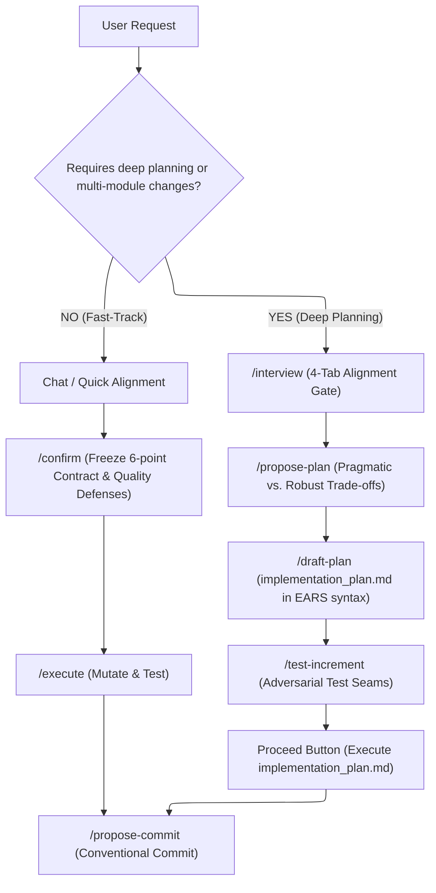

# Get-Thing-Done (GTD) Framework - Antigravity

Systematic agent workflows that enforce deep architectural reasoning over fast code generation—ensuring AI builds exactly what you want with zero-regression reliability.

## Antigravity Installation

### Global Install (available everywhere)

**Linux/macOS:**

```bash
git clone https://github.com/Hoang604/get-thing-done.git gtd-temp
cd gtd-temp && chmod +x *.sh && ./install.sh
cd .. && rm -rf gtd-temp
```

**Windows:**

> [!NOTE]
> Windows does not have a default/native install script. On Windows, run the installation inside **WSL (Windows Subsystem for Linux)** or a POSIX-compatible environment using the Linux/macOS command above.

---

## 1. Core Execution Pipelines (Daily Delivery)

The GTD framework splits execution into **two primary tracks** depending on task blast-radius and complexity:



> [!NOTE]
> Every skill listed below has an identical corresponding slash command available in `.gemini/antigravity-cli/skills/` and `.agents/skills/` (synced to `.gemini/config/skills/`).

### Track 1: Fast-Track Execution (Direct Contract)
*For focused bug fixes, single-module enhancements, or well-understood tasks without planning artifact overhead.*

- **[confirm](.gemini/config/skills/confirm/SKILL.md)**: Freeze the 6-point technical contract (intent, user outcomes, target files, deterministic choices, verification command) and 8 Quality Defenses before execution.
- **[execute](.gemini/config/skills/execute/SKILL.md)**: Execute an approved contract with continuous verification.
- **[propose-commit](.gemini/config/skills/propose-commit/SKILL.md)**: Propose a high-signal conventional commit message for the completed changes.

### Track 2: Deep Architectural Planning (Full Engineering Rigor)
*For complex subsystems, high-risk refactors, cross-cutting migrations, or new domain features.*

- **[interview](.gemini/config/skills/interview/SKILL.md)**: Interactive alignment interview with a 4-tab playback gate to guarantee 100% shared understanding before any plan or code is written.
- **[propose-plan](.gemini/config/skills/propose-plan/SKILL.md)**: Gather context, classify quality tiers (Tier 1–5), and propose two architectural approaches (Pragmatic vs. Robust) with clear trade-offs.
- **[draft-plan](.gemini/config/skills/draft-plan/SKILL.md)**: Draft formal `implementation_plan.md` artifact using EARS syntax with zero-prose literal contracts and seam test matrix.
- **[test-increment](.gemini/config/skills/test-increment/SKILL.md)**: Design adversarial test seams and update the implementation plan immediately.
- **Proceed Button**: Click the interactive **Proceed** button directly on the approved `implementation_plan.md` artifact to execute changes step-by-step with verified test proofs.
- **[propose-commit](.gemini/config/skills/propose-commit/SKILL.md)**: Propose a conventional commit message once verified.

---

## 2. Specialized Engineering Toolkits (On-Demand)

### 🐛 Bug Hunting & Remediation
*Use when investigating regressions, production defects, or stress-testing resilience.*

- **[fix-bug](.gemini/config/skills/fix-bug/SKILL.md)**: Probe-driven root cause diagnosis and verified zero-regression remediation.
- **[bug-hunt](.gemini/config/skills/bug-hunt/SKILL.md)**: Autonomous iterative red/green hunting loop driven by blind audit subagents.
- **[stress-test](.gemini/config/skills/stress-test/SKILL.md)**: Audit and harden agent-produced code across edge regimes and concurrency boundaries.

### 🔍 Code Review & Verification
*Use before merging PRs or when validating review findings.*

- **[code-review](.gemini/config/skills/code-review/SKILL.md)**: Deep architectural code review across correctness, security, and performance.
- **[verify-issue](.gemini/config/skills/verify-issue/SKILL.md)**: Trace codepaths to verify whether flagged review findings are real bugs or false positives.

### 🧭 Codebase Exploration & Orientation
*Use when exploring an unfamiliar codebase or ramping up on architecture.*

- **[explain](.gemini/config/skills/explain/SKILL.md)**: Causal walk-through of a specific feature slice, data flow, or lifecycle.
- **[explain-architecture](.gemini/config/skills/explain-architecture/SKILL.md)**: Map the global architectural skeleton, module boundaries, and seams.

### 📋 Large Feature Intake & Decomposition
*Use upstream of Track 2 for complex enterprise features requiring formal requirement decomposition.*

- **[spec](.gemini/config/skills/spec/SKILL.md)**: Relentlessly interview to extract domain requirements and edge cases in EARS syntax.
- **[to-ticket](.gemini/config/skills/to-ticket/SKILL.md)**: Break a confirmed `SPEC.md` into dependency-ordered tracer-bullet tickets.

### 🧪 Test Strategy & API Verification
*Use when designing comprehensive testing harnesses or API collections.*

- **[create-test](.gemini/config/skills/create-test/SKILL.md)**: Design deterministic unit and integration test suites at clean external seams.
- **[create-postman-collection](.gemini/config/skills/create-postman-collection/SKILL.md)**: Design executable, schema-validated Postman test collections.

### 🤖 Autonomous Loops & Craft Foundations
*Autonomous agent execution patterns and core craft references.*

- **[awareness](.gemini/config/skills/awareness/SKILL.md)**: Run autonomous multi-turn `goal.md` self-review loops (Antigravity CLI).
- **[frontend-design](.gemini/config/skills/frontend-design/SKILL.md)**: Create distinctive, production-grade frontend interfaces with high visual quality.
- **[write-great-skills](.gemini/config/skills/write-great-skills/SKILL.md)**: Reference vocabulary and principles for writing predictable, high-signal skills.
